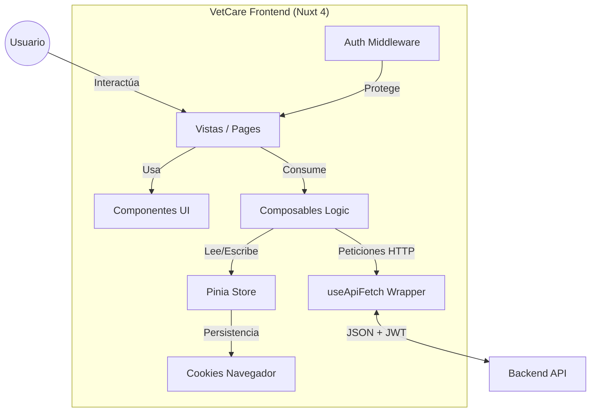

# 🐾 VetCare System - Frontend Client

> Plataforma integral para la gestión administrativa y clínica de centros veterinarios.

Este repositorio contiene el código fuente del cliente Frontend del sistema **VetCare**, desarrollado como una Single Page Application (SPA) moderna, escalable y fuertemente tipada.

---

##  Tecnologías y Stack

El proyecto ha sido construido utilizando la última tecnología del ecosistema Vue.js:

* **Framework Principal:** [Nuxt 4](https://nuxt.com) (Arquitectura modular y SSR Híbrido).
* **Lenguaje:** TypeScript (Strict mode) para tipado estático robusto.
* **UI & Estilos:** [Nuxt UI](https://ui.nuxt.com/) (Sistema de diseño basado en Tailwind CSS).
* **Iconografía:** Lucide Icons (integrado vía Nuxt Icon).
* **Gestión de Estado:** [Pinia](https://pinia.vuejs.org/) para manejo de sesiones y datos globales.
* **Cliente HTTP:** `useApiFetch` (Wrapper personalizado de `$fetch` con interceptores).

---

##  Guía de Instalación y Despliegue

Sigue estos pasos para levantar el proyecto en tu entorno local de desarrollo.

### Prerrequisitos
* Node.js (v18 o superior)
* NPM o Yarn
* Backend API corriendo (por defecto en `http://localhost:3000` o `8000`)

### 1. Clonar el repositorio
```bash
git clone [https://github.com/tu-usuario/vetcare-frontend.git](https://github.com/tu-usuario/vetcare-frontend.git)
cd vetcare-frontend
```
### 2. Instalar dependencias
```bash
npm install
```
### 3. Configuración de Entorno
Asegúrate de configurar la URL de tu API Backend. Puedes hacerlo creando un archivo `.env` en la raíz o modificando directamente `nuxt.config.ts`:
```.env
NUXT_PUBLIC_API_BASE=http://localhost:3000
```

### 4. Ejecutar servidor de desarrollo
```bash
npm run dev 
```

## Arquitectura Frontend 
El frontend sigue una arquitectura basada en Capas de Aplicación dentro del directorio app/ de Nuxt 4, separando claramente la interfaz de usuario de la lógica de negocio mediante Composables.

### Diagrama de arquitectura


### Estructura de Directorios
Organización siguiendo las convenciones modernas de Nuxt 4
```
vetcare-frontend/
├── app/
│   ├── components/      # Componentes UI (PetForm, Tables, Modals)
│   ├── composables/     # Lógica de negocio reutilizable (usePets, useApiFetch)
│   ├── layouts/         # Plantillas (default con sidebar, login centrado)
│   ├── middleware/      # Guardianes de ruta (auth.global.ts)
│   ├── pages/           # Rutas automáticas (index.vue, login.vue, pets/[id].vue)
│   ├── plugins/         # Plugins de inicialización (restore session)
│   └── store/           # Estado global con Pinia (auth.ts)
├── assets/              # Recursos estáticos
├── nuxt.config.ts       # Configuración del framework
└── types/               # Definiciones TypeScript (Interfaces)
```
## Flujo de Autenticación y Seguridad
El sistema implementa autenticación mediante JWT (JSON Web Tokens) con las siguientes características de seguridad:

Interceptores HTTP: Inyección automática del header Authorization en todas las peticiones salientes.

Manejo de Errores 401: Logout automático y redirección si el token expira.

Persistencia de Sesión: Recuperación de estado mediante Cookies seguras al recargar la página (F5).

Middleware de Protección: Bloqueo de rutas privadas (/pets, /owners) para usuarios no autenticados.
### Diagrama de login

```mermaid
sequenceDiagram
    autonumber
    actor User as  Usuario
    participant App as  Frontend (Nuxt)
    participant API as  Backend API

    %% FASE 1: INTERACCION
    Note over User, App: Paso 1: Credenciales
    User->>App: Escribe Email y Contraseña
    App->>App: Valida formato (UI)

    %% FASE 2: RED Y DATOS
    rect rgb(30, 35, 45)
        Note over App, API: Paso 2: Autenticación
        App->>API: POST /api/auth/login
        activate API
        API-->>App:  Retorna Token JWT
        deactivate API

        App->>App: Guarda Token en Cookie �
        
        App->>API: GET /api/auth/profile
        activate API
        API-->>App:  Retorna Datos del Usuario
        deactivate API
    end

    %% FASE 3: REDIRECCION
    Note over User, App: Paso 3: Acceso
    App->>App: Actualiza Store (Pinia)
    App-->>User: Redirige al Dashboard �
```


